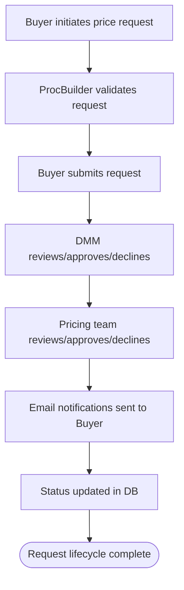
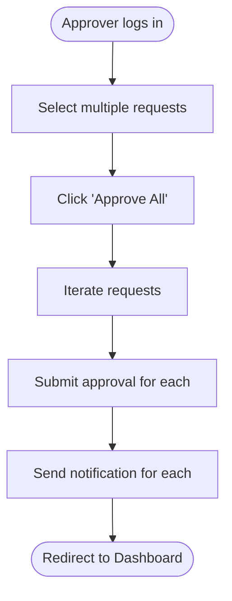
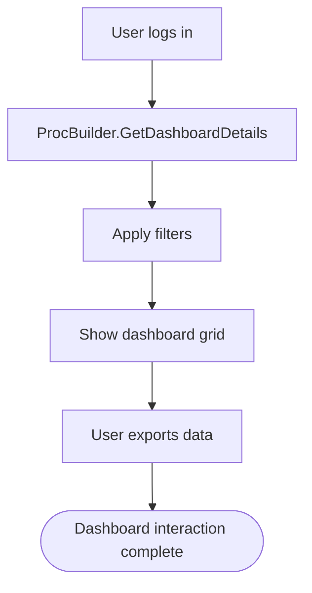
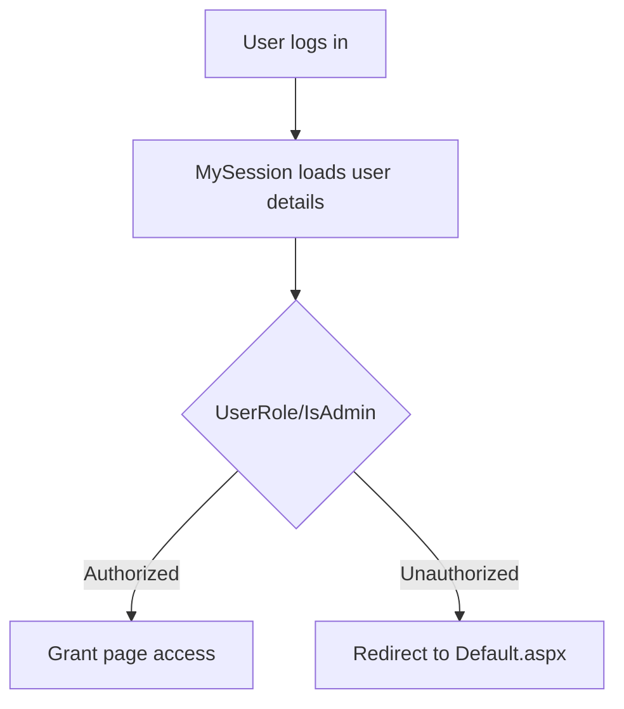
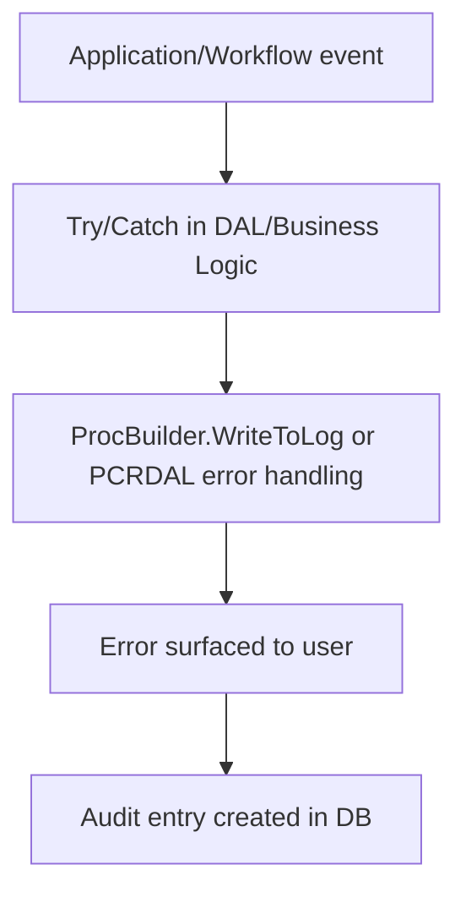
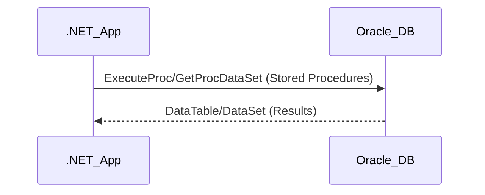
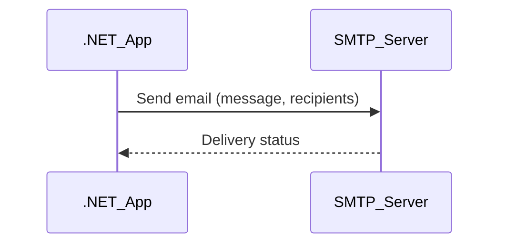
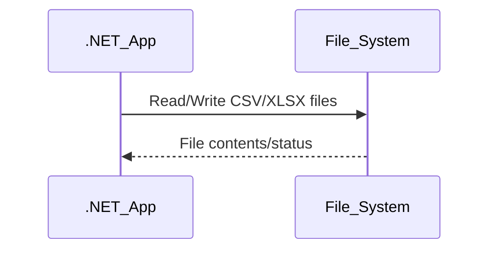

# .NET Application Functional & Integration Documentation

## 1. Functional Flow Diagrams

### 1.1 Pricing Approval Workflow
```mermaid
flowchart TD
    Start([User logs in])
    CheckRole{Is PRICING_SUPER_USER?}
    Dashboard[Show Pricing Approval Dashboard]
    Filter[User applies filters (status, request type, buying area, effective date)]
    Requests[Display filtered pricing requests]
    Select[User selects requests for approval]
    Approve[User clicks 'Approve Selected']
    BulkApprove[Bulk approval logic iterates requests]
    UpdateStatus[ProcBuilder.SubmitPricingApproval called for each request]
    Notify[EmailRevised.SendNotification triggers email]
    End([Redirect to Dashboard])
    Start --> CheckRole
    CheckRole -- Yes --> Dashboard
    CheckRole -- No --> Redirect[Redirect to Default.aspx]
    Dashboard --> Filter
    Filter --> Requests
    Requests --> Select
    Select --> Approve
    Approve --> BulkApprove
    BulkApprove --> UpdateStatus
    UpdateStatus --> Notify
    Notify --> End
```

### 1.2 Order Lifecycle (Exception/Original Price Request)


### 1.3 Bulk Operations (Batch Approvals)


### 1.4 Dashboard & Reporting


### 1.5 User Management & Role-Based Access


### 1.6 Alerting & Notifications
```mermaid
flowchart TD
    Action[Business event triggers (approval, decline, etc.)]
    BuildEmail[Email.cs builds message]
    GetRecipients[Email.cs gets recipient list]
    SendSMTP[Email sent via SMTP]
    Log[Log notification event]
    Action --> BuildEmail --> GetRecipients --> SendSMTP --> Log
```

### 1.7 Exception Handling & Audit Logging


---

## 2. Core Business Functionalities

| Functionality Name         | Description                                                                 | Main Classes/Files                         | Key Business Rules/Validations                                         | Actors                    |
|---------------------------|-----------------------------------------------------------------------------|--------------------------------------------|-----------------------------------------------------------------------|---------------------------|
| Pricing Approval Workflow  | Approvers review, filter, and bulk approve pricing requests                 | PricingApproval.aspx.cs, ProcBuilder.cs    | Only PRICING_SUPER_USER can approve; status transitions; notifications | Pricing Approver          |
| Order Lifecycle           | Buyer submits price change request; DMM and Pricing approve/decline         | ProcBuilder.cs, Email.cs, Review.aspx.cs   | Validation of request; multi-step approval; email notifications        | Buyer, DMM, Pricing Team  |
| Bulk Operations           | Approvers can approve multiple requests in one action                       | PricingApproval.aspx.cs, ProcBuilder.cs    | Bulk approval iterates requests; notifications for each                | Pricing Approver          |
| Dashboard & Reporting     | Users view, filter, and export request data                                 | PricingDashboard.aspx.cs, ProcBuilder.cs   | Data filtered by role, status, date; export to Excel                   | All Users                 |
| User Management           | Session/user context, role-based access control                             | MySession.cs, ProcBuilder.cs               | Access checks on page load; admin roles; session initialization        | All Users, Admin          |
| Alerting & Notifications  | Email alerts for approvals, declines, deadlines                             | Email.cs, EmailRevised.cs, ProcBuilder.cs  | Dynamic recipient lists; message content based on workflow status      | All Users                 |
| Inventory Management      | Style/SKU reconciliation, uploads, validations                              | ProcBuilder.cs, Upload.cs                  | Validation of SKUs/styles; error handling for duplicates, invalid data | Buyer, Approver           |
| Supplier Onboarding       | Adding visibility users, chain management                                   | ProcBuilder.cs                             | Add/delete visibility users; chain updates                             | Admin, Buyer              |
| Exception Handling & Audit| Error catching, logging, audit trail                                        | ProcBuilder.cs, PCRDAL.cs, Global.asax.cs  | Log errors, audit user actions, surface errors to UI                   | All Users, Admin          |
| Administrative Utilities  | Maintenance, chain updates, effective date management                       | Maintenance.aspx.cs, ProcBuilder.cs        | Admin role required; update/delete operations                          | Admin                     |

---

## 3. Integration Touchpoints & Interface Diagrams

### 3.1 Oracle Database Integration
- **External System:** Oracle DB (PACER_PKG, PACER_EXPORT, PACER_FILE_UPLOAD)
- **Purpose:** All business data, workflow, audit, and validation operations
- **Data Exchanged:** Requests, approvals, user/session, styles/SKUs, logs, exports
- **Protocol/Technology:** Oracle ManagedDataAccess (.NET), Stored Procedures
- **Main Classes/Files:** PCRDAL.cs, ProcBuilder.cs, MySession.cs



### 3.2 SMTP Email Notification
- **External System:** SMTP Email Server
- **Purpose:** Send workflow notifications (approvals, declines, deadlines)
- **Data Exchanged:** Email messages (HTML), recipient lists
- **Protocol/Technology:** SMTP (System.Net.Mail or similar)
- **Main Classes/Files:** Email.cs, EmailRevised.cs



### 3.3 File System Integration (Bulk Uploads, Exports)
- **External System:** File System (App_Data/file_upload, Excel exports)
- **Purpose:** Upload bulk SKU/style data, export reports
- **Data Exchanged:** CSV/XLSX files (input/output)
- **Protocol/Technology:** File I/O (.NET System.IO)
- **Main Classes/Files:** Upload.cs, ProcBuilder.cs, GridViewExport.cs



---

## 4. Appendix

### List of Analyzed Files
- Global.asax.cs
- App_Code/ProcBuilder.cs
- App_Code/PCRDAL.cs
- App_Code/Email.cs
- App_Code/Upload.cs
- App_Code/MySession.cs
- PricingApproval.aspx.cs
- (Other workflow pages: Review.aspx.cs, Edit.aspx.cs, Maintenance.aspx.cs, etc.)

### Glossary of Business Terms

| Term                | Definition                                                                 |
|---------------------|----------------------------------------------------------------------------|
| PACER               | Pricing Approval and Change Event Request system                            |
| DMM                 | Divisional Merchandise Manager (approver role)                              |
| PRICING_SUPER_USER  | User role with pricing approval privileges                                  |
| SKU                 | Stock Keeping Unit (inventory item)                                        |
| Style               | Product style identifier                                                    |
| Exception Price     | Non-standard price request                                                  |
| Original Price      | Standard/original price request                                             |
| Bulk Approval       | Approving multiple requests in one action                                   |
| Dashboard           | Main UI for viewing/filtering requests                                      |
| Audit Log           | Record of user actions/events                                               |
| Visibility User     | User with access to specific pricing events                                 |
| Chain               | Store chain identifier                                                      |
| Effective Date      | Date when price change takes effect                                         |


