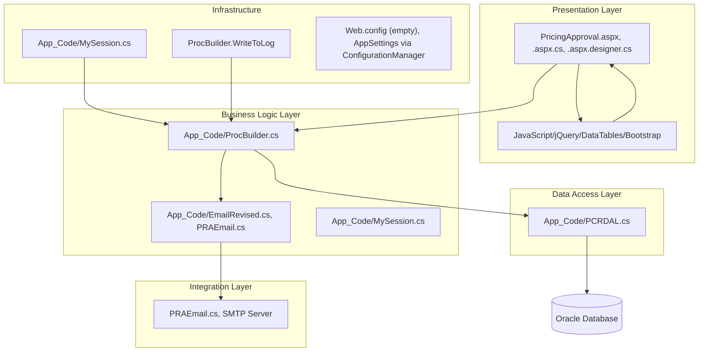

# High-Level Architecture Document: Pricing Approval Workflow

## 1. Overview
- **Purpose:**  
  This document provides a comprehensive technical and backend analysis of the Pricing Approval Workflow subsystem within the PACER .NET Framework application. It details the workflow’s architectural layers, components, data flows, integration points, and security mechanisms, serving as a blueprint for architects, developers, and DevOps teams.
- **Scope:**  
  The analysis is strictly limited to the Pricing Approval Workflow, including UI triggers, role/access verification, data retrieval/filtering, approval processing, notifications, exception handling, and all integrations directly related to this workflow.
- **Audience:**  
  Solution architects, backend/API developers, DevOps, security reviewers, and technical leads responsible for maintenance, modernization, or integration of the Pricing Approval Workflow.

## 2. Technology Stack
| Layer/Component | Technology/Framework         | Version   | Notes                                                                                      |
|-----------------|-----------------------------|-----------|--------------------------------------------------------------------------------------------|
| .NET Framework  | ASP.NET Web Forms           | 4.x       | Code-behind in C#, master pages, App_Code structure                                        |
| Language        | C#                          |           | All backend logic, business rules, and DAL                                                 |
| Web Framework   | ASP.NET Web Forms           |           | .aspx pages, code-behind, event-driven                                                     |
| ORM/Data Access | Oracle.ManagedDataAccess     |           | Direct Oracle DB access via stored procedures                                              |
| Frontend        | ASPX, JavaScript, jQuery    |           | DataTables, Bootstrap for UI/UX                                                            |
| Database        | Oracle                      |           | All workflow data, state, and user/role info persisted in Oracle via stored procs          |
| Messaging       | SMTP (via PRAEmail/Email)   |           | Email notifications for workflow state changes                                             |
| Caching         | Session (ASP.NET)           |           | User/session state managed in MySession                                                    |
| Logging         | Custom (ProcBuilder.WriteToLog) |       | User actions logged to Oracle via stored procedure                                         |
| Others          | DataTables.net, Bootstrap   |           | UI grid and styling                                                                        |

## 3. Architectural Layers & Components

**Layered Diagram:**  


- Only users with `PRICING_SUPER_USER` role can access PricingApproval.aspx.
- Batch approval and notification logic are present.
- All data access and workflow logic are encapsulated in `ProcBuilder` methods.

**Layer Descriptions:**  
- **Presentation Layer:**  
  - Files: `PricingApproval.aspx`, `PricingApproval.aspx.cs`, `PricingApproval.aspx.designer.cs`
  - Triggers workflow actions, displays approval dashboard, handles user input/events.
- **Business Logic Layer:**  
  - Files: `App_Code/ProcBuilder.cs`, `App_Code/EmailRevised.cs`, `App_Code/MySession.cs`
  - Implements workflow logic, approval state transitions, batch processing, and notification triggers.
- **Data Access Layer:**  
  - Files: `App_Code/PCRDAL.cs`
  - Handles all Oracle DB connectivity and execution of stored procedures.
- **Integration Layer:**  
  - Files: `App_Code/PRAEmail.cs`, `App_Code/EmailRevised.cs`
  - Sends workflow state change notifications via SMTP.
- **Infrastructure:**  
  - Files: `App_Code/MySession.cs`, `ProcBuilder.WriteToLog`, `Web.config` (empty), `ConfigurationManager`
  - Manages session, role, and logging.

**Major Components Table:**
| Component Name                | Role/Purpose                                      | Layer                | Key Dependencies         | Location (Path)                                         |
|-------------------------------|---------------------------------------------------|----------------------|-------------------------|---------------------------------------------------------|
| PricingApproval.aspx/.cs      | UI for pricing approval dashboard, triggers events| Presentation         | MySession, ProcBuilder  | /PricingApproval.aspx, /PricingApproval.aspx.cs          |
| App_Code/ProcBuilder.cs       | Workflow/business logic, DB access, state changes | Business Logic       | PCRDAL, Oracle DB       | /App_Code/ProcBuilder.cs                                |
| App_Code/EmailRevised.cs      | Notification logic, builds/sends emails           | Business Logic/Integration | PRAEmail, ProcBuilder | /App_Code/EmailRevised.cs                               |
| App_Code/PRAEmail.cs          | Sends emails via SMTP                             | Integration          | SMTP                    | /App_Code/PRAEmail.cs                                   |
| App_Code/MySession.cs         | User/session/role management                      | Infrastructure       | ProcBuilder, HttpContext| /App_Code/MySession.cs                                  |
| App_Code/PCRDAL.cs            | Oracle DB connectivity, executes procs            | Data Access          | Oracle.ManagedDataAccess| /App_Code/PCRDAL.cs                                     |

## 4. Integration Points
| Integration Name          | Type (API/DB/etc.) | Technology/Protocol | Purpose                                    | Security/Auth                | Location in Code                |
|--------------------------|--------------------|---------------------|--------------------------------------------|------------------------------|---------------------------------|
| Oracle Database          | DB                 | Oracle ODP.NET      | Stores workflow data, user/role info, state| DB credentials (in config)   | App_Code/ProcBuilder.cs, PCRDAL.cs |
| SMTP Email Server        | Messaging          | SMTP                | Sends workflow notifications               | SMTP relay, internal access  | App_Code/PRAEmail.cs, EmailRevised.cs |
| ASP.NET Session          | State Mgmt         | In-memory           | Stores user/role/session state             | ASP.NET session              | App_Code/MySession.cs           |

## 5. Deployment & Infrastructure (Pricing Approval Workflow-specific)
- **Hosting Model:**  
  ASP.NET Web Forms application, hosted on IIS.
- **Deployment Topology Diagram:**  
  ```mermaid
  %% Deployment diagram
    graph TD
    User --> Browser
    Browser --> IIS
    IIS --> App["ASP.NET Web App (PACER)"]
    App --> OracleDB[(Oracle Database)]
    App --> SMTP[SMTP Email Server]
  ```
- **Environments:**  
  - Dev/Test/Prod separation inferred from `MySession.Current.LinkToProd` and email logic.
  - AppSettings (e.g., linkToProd) loaded via ConfigurationManager.
- **Scalability/Availability:**  
  - Standard IIS scaling (web farm possible); Oracle DB backend.
- **Network/Security:**  
  - Access restricted to users with `PRICING_SUPER_USER` role.
  - Internal SMTP; Oracle DB credentials managed via configuration (not visible in code).

## 6. Architectural Patterns & Design Decisions
- **Patterns Used:**  
  - Layered Architecture (Presentation, Business Logic, Data Access, Integration)
  - Repository/Service pattern for DB access (ProcBuilder, PCRDAL)
  - Session-based authentication/authorization
  - Event-driven UI (Web Forms)
- **Key Decisions:**  
  - All workflow logic is encapsulated in ProcBuilder for maintainability.
  - Role-based access enforced in UI and session.
  - Batch approval and notification logic for efficiency.
  - Oracle stored procedures centralize business rules and state transitions.
- **Cross-Cutting Concerns:**  
  - Logging: User actions logged via ProcBuilder.WriteToLog to Oracle.
  - Error Handling: Try/catch in UI and business logic; exceptions thrown/logged.
  - Security: Role checks in UI and session; workflow actions only for authorized users.
  - Notification: Email notifications for each workflow state transition.

## 7. Appendix

**List of analyzed files directly related to Pricing Approval Workflow:**
- /PricingApproval.aspx
- /PricingApproval.aspx.cs
- /PricingApproval.aspx.designer.cs
- /App_Code/ProcBuilder.cs
- /App_Code/EmailRevised.cs
- /App_Code/PRAEmail.cs
- /App_Code/MySession.cs
- /App_Code/PCRDAL.cs

**Glossary of relevant business and technical terms:**
- **PACER:** Application name, Pricing Approval and Change Event Request.
- **Pricing Approval Workflow:** Process for reviewing and approving pricing change requests.
- **PRICING_SUPER_USER:** Role required to access Pricing Approval dashboard.
- **ProcBuilder:** Central business logic and workflow class.
- **PCRDAL:** Data Access Layer for Oracle DB.
- **PRAEmail/EmailRevised:** Classes for notification email composition and delivery.
- **Session:** ASP.NET session object storing user/role/context.
- **Oracle Stored Procedures:** Backend business logic and data/state management.
- **SMTP:** Protocol for sending workflow notification emails.
- **Dashboard:** UI grid displaying pending/completed approval requests.

---

**All statements, diagrams, and tables above are directly evidenced by the codebase and configuration files of the provided .NET Framework project, with a strict focus on the Pricing Approval Workflow.**
