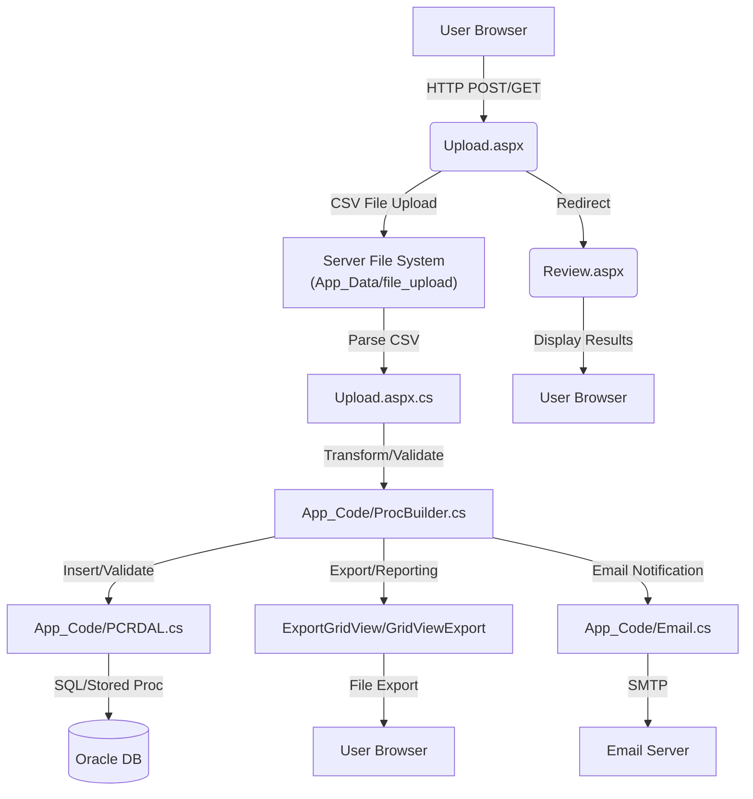

# Data Map – PACER Pricing Change Request (PCR)

## 1. Document Overview

- **Purpose:**  
  This Data Map documents all incoming and outbound data flows, internal data propagation, integration points, data models, and security considerations for the PACER Pricing Change Request (.NET Framework) application.

- **Scope:**  
  Modules/systems analyzed:
  - Web forms (Upload.aspx, Review.aspx, Maintenance.aspx, etc.)
  - App_Code (ProcBuilder, PCRDAL, QueryBuilder, etc.)
  - Data Access Layer (Oracle DB)
  - Configuration (Web.config, connection strings)
  - File upload and export logic
  - Data models (CSV, DataTable, internal entities)

- **Audience:**  
  Data Architects, Integration Engineers, Security Teams, Compliance Officers, Application Developers.

---

## 2. Data Flow Summary Diagram



---

## 3. Incoming Data Flows

| Entry Point                | Source System      | Method    | Data Contract/Model | Format | Auth         | Transformation/Validation              | Target Module         |
|---------------------------|--------------------|-----------|---------------------|--------|--------------|----------------------------------------|----------------------|
| /Upload.aspx (POST)       | User Browser       | HTTP POST | CSV (Style/SKU/Color) | CSV    | Windows Auth | CSV parsing, duplicate check, validation| Upload.aspx.cs       |
| /Upload.aspx (GET)        | User Browser       | HTTP GET  | QueryString: p_id   | URL    | Windows Auth | p_id lookup, header details fetch      | Upload.aspx.cs       |
| /Upload.aspx (Reupload)   | User Browser       | HTTP POST | CSV                 | CSV    | Windows Auth | CSV parsing, duplicate/non-numeric check| Upload.aspx.cs       |
| /Maintenance.aspx         | User Browser       | HTTP GET  | QueryString         | URL    | Windows Auth | DataTable fetch, status update         | Maintenance.aspx.cs  |
| /Review.aspx              | User Browser       | HTTP GET  | QueryString: p_id   | URL    | Windows Auth | DataTable fetch, result display        | Review.aspx.cs       |

**Example: File Upload (Upload.aspx.cs, btnReupload_Click, line ~190)**
- Accepts CSV file from user, saves to `App_Data/file_upload/`.
- Validates file extension, parses CSV, checks duplicates, validates data, inserts into DB.
- Sample CSV payload:
  ```
  STYLE_NUMBER,PRICE
  12345,19.99
  67890,24.99
  ```

---

## 4. Outbound Data Flows

| Exit Point                | Destination System | Method    | Data Contract/Model | Format | Auth         | Transformation/Mapping                 | Source Module        |
|--------------------------|--------------------|-----------|---------------------|--------|--------------|----------------------------------------|----------------------|
| DB Insert/Update         | Oracle DB          | SQL/SP    | DataTable, Params   | SQL    | DB Creds     | Field mapping, validation, cleansing   | PCRDAL.cs, ProcBuilder.cs |
| File Export (Download)   | User Browser       | HTTP GET  | DataTable           | CSV/XLS | Windows Auth | DataTable to CSV/XLS                   | ExportGridView/GridViewExport |
| Email Notification       | Email Server       | SMTP      | EmailContent        | HTML/TXT| SMTP Config  | Template mapping, address lookup        | App_Code/Email.cs    |

**Example: DB Insert (PCRDAL.cs, InsertData, line ~25)**
- Inserts validated rows into Oracle DB using SQL or stored procedures.
- Connection string and credentials are decrypted from config.

**Example: File Export (Upload.aspx.cs, btnUploadResults_Click, line ~250)**
- Exports DataTable results to CSV/XLS for user download.

---

## 5. Internal Data Propagation

- **Sequence:**  
  1. User uploads CSV via Upload.aspx.
  2. Upload.aspx.cs parses CSV, creates DataTable.
  3. DataTable passed to QueryBuilder/ProcBuilder for bulk insert.
  4. ProcBuilder invokes validation stored procedures (e.g., `insert_upload_styles`, `insert_upload_skus`).
  5. PCRDAL executes SQL/SP to Oracle DB.
  6. Validation results, duplicates, and errors are fetched via stored procedures and displayed to user.
  7. On success, user can export results or receive email notifications.

- **Transformation/Validation:**  
  - CSV fields are mapped to DB columns (`STYLE_NUMBER`, `SKU`, `PRICE`).
  - Duplicates are checked via stored procedures.
  - Non-numeric SKUs are flagged.
  - Invalid rows are separated for user correction.
  - Data is truncated to max length (4000 chars) for DB safety.

---

## 6. Data Models & Schemas

| Model Name         | Used In         | Fields (Type, Constraints)           | Source/Target | Mapping Notes                       |
|--------------------|----------------|--------------------------------------|---------------|-------------------------------------|
| StyleUpload CSV    | Upload.aspx.cs | STYLE_NUMBER (string), PRICE (decimal)| Incoming      | Maps to pacer_upload_style table    |
| SKUUpload CSV      | Upload.aspx.cs | SKU (string, numeric), PRICE (decimal)| Incoming      | Maps to pacer_upload_sku table      |
| StyleColorUpload   | Upload.aspx.cs | STYLE_NUMBER, COLOR_CODE, PRICE      | Incoming      | Maps to pacer_upload_sku via lookup |
| DataTable          | App_Code       | Varies by proc/table                 | Internal      | Used for bulk insert and export     |

**Code Reference:**  
- Upload.aspx.cs, StyleUpload/SKUUpload/StyleColorUpload methods (~line 300+)
- DataTable schema defined inline, columns added per upload type.

---

## 7. Integration Points

| Integration        | Type      | Endpoint/Connection                  | Data Exchanged         | Libraries/SDKs         | Config Details              |
|--------------------|-----------|--------------------------------------|------------------------|------------------------|-----------------------------|
| Oracle DB          | SQL/SP    | Connection string (decrypted)        | Style/SKU/Color, status| Oracle.ManagedDataAccess| Web.config: DDWDatabaseUser, DDWDatabasePassword, DDWDatabaseSIDFull |
| Email Server       | SMTP      | SMTP server (from config)            | EmailContent           | System.Net.Mail        | Web.config (not shown)      |
| File System        | Local     | App_Data/file_upload/                | CSV files              | System.IO              | N/A                         |

---

## 8. Sensitive Data & Security Considerations

- **Sensitive Fields:**  
  - User credentials (DB connection, decrypted in PCRDAL.cs)
  - Uploaded file contents (potential PII in CSV)
  - Email addresses (from DB, sent via SMTP)
- **Protection:**  
  - DB credentials encrypted in config, decrypted at runtime.
  - File uploads stored in restricted server directory.
  - All data transfers (HTTP, SMTP) rely on Windows authentication and internal network.
  - Data length and type validation before DB insert.
- **Compliance/Audit:**  
  - All uploads, exports, and DB changes logged via WriteToLog (ProcBuilder.cs).
  - Email notifications and exports traceable to user actions.

---

## 9. Appendix

- **Analyzed Files:**
  - Upload.aspx, Upload.aspx.cs – Main entry point for file uploads.
  - App_Code/ProcBuilder.cs – Business logic, validation, DB integration.
  - App_Code/PCRDAL.cs – Data access layer, DB connection/queries.
  - App_Code/QueryBuilder.cs – Bulk insert logic.
  - ExportGridView/GridViewExport.cs – Export logic for outbound files.
  - App_Code/Email.cs – Email notification logic.
  - Web.config – Configuration (connection strings, credentials).
  - App_Data/file_upload/ – Uploaded files (CSV).

- **Glossary:**
  - **CSV:** Comma-separated values file, used for bulk upload.
  - **DataTable:** .NET in-memory table for bulk operations.
  - **Stored Procedure (SP):** Oracle DB logic for validation, insert, export.
  - **PCR:** Pricing Change Request.
  - **PACER:** Pricing Approval and Change Event Request.
