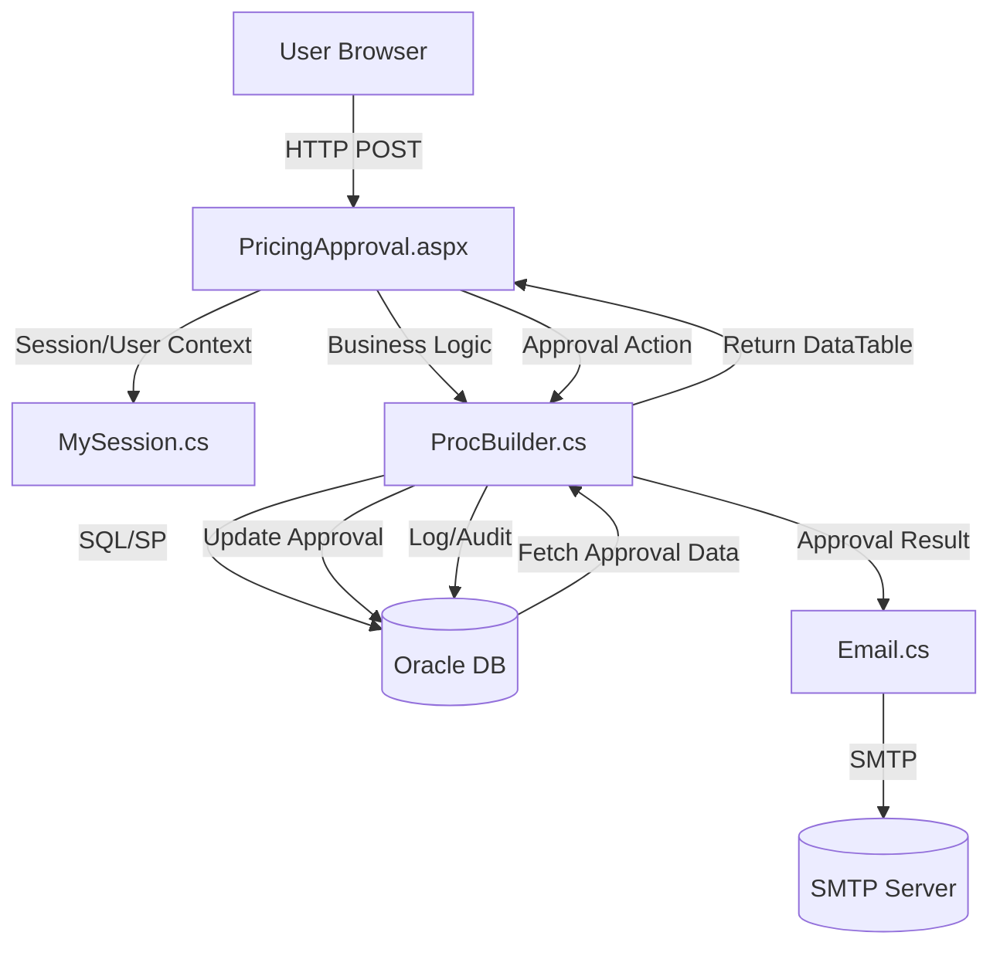

# Data Map – Pricing Approval Workflow

## 1. Document Overview
- **Purpose:** This Data Map documents all data flows, integration points, data models, and security mechanisms for the Pricing Approval Workflow in the PACER .NET application.
- **Scope:** Analysis covers PricingApproval.aspx/.cs, ProcBuilder.cs, MySession.cs, Email.cs, PCRDAL.cs, and relevant Oracle stored procedures and configuration.
- **Audience:** Data Architects, Integration Engineers, Security Teams, Compliance Officers.

## 2. Data Flow Summary Diagram

## 3. Incoming Data Flows

| Entry Point                              | Source System   | Method      | Data Contract/Model         | Format     | Auth         | Transformation/Validation         | Target Module             |
|-------------------------------------------|-----------------|-------------|----------------------------|------------|--------------|-----------------------------------|---------------------------|
| PricingApproval.aspx                      | User Browser    | HTTP POST   | ApprovalRequest (fields)    | Form Data  | Windows Auth | Validation, Role Check            | PricingApproval.aspx.cs    |
| PricingApproval.aspx.cs (Page_Load)       | App Context     | Session     | UserRole, UserID            | Session    | Implicit     | Authorization, Role Validation    | MySession.cs               |
| PricingApproval.aspx.cs (getRequestsByFilters) | Oracle DB      | SQL/SP      | ApprovalDataSet             | DataTable  | DB User      | Status Filtering                  | ProcBuilder.cs             |
| ProcBuilder.GetDashboardDetails           | Oracle DB       | SP/SQL      | DashboardDetails            | DataTable  | DB User      | User/Role Filtering               | ProcBuilder.cs             |
| ProcBuilder.GetDropdownList               | Oracle DB       | SP/SQL      | DropdownList                | DataTable  | DB User      | List Filtering                    | ProcBuilder.cs             |
| MySession.cs (User Context)               | Oracle DB       | SP/SQL      | UserDetails                 | DataTable  | DB User      | Session Initialization            | MySession.cs               |

**Sample Payloads:**
- ApprovalRequest: `{ p_id: "12345", on_or_off: "on", ... }`
- Session: `{ UserID: "jdoe", UserRole: "PRICING_SUPER_USER", ... }`

## 4. Outbound Data Flows

| Exit Point                                | Destination System | Method      | Data Contract/Model      | Format   | Auth         | Transformation/Mapping           | Source Module             |
|--------------------------------------------|--------------------|-------------|-------------------------|----------|--------------|----------------------------------|---------------------------|
| ProcBuilder.SubmitPricingApproval          | Oracle DB          | SP/SQL      | ApprovalStatusRecord    | SQL      | DB Creds     | Approval decision commit         | ProcBuilder.cs            |
| ProcBuilder.WriteToLog                     | Oracle DB          | SP/SQL      | AuditLogRecord          | SQL      | DB Creds     | Audit/Access log                 | ProcBuilder.cs            |
| EmailRevised.SendNotification              | SMTP Server        | SMTP        | ApprovalEmail           | HTML     | SMTP Config  | Map approval details to template | Email.cs                  |

**Sample Payloads:**
- ApprovalStatusRecord: `{ p_pricing_id: "12345", p_user_id: "jdoe", p_pricing_notes: "Approved", p_pricing_approval: "approve", ... }`
- ApprovalEmail: HTML-formatted email with approval details, recipients, and review link.

## 5. Internal Data Propagation

- **Sequence:**
    1. User accesses PricingApproval.aspx (HTTP GET/POST).
    2. MySession.cs initializes user context from Oracle DB.
    3. PricingApproval.aspx.cs loads dashboard and dropdowns via ProcBuilder.cs (Oracle SPs).
    4. User filters requests; getRequestsByFilters calls ProcBuilder.GetRequestByFiltersU.
    5. User selects approvals; btnApproveSelected_Click parses selection, calls ProcBuilder.SubmitPricingApproval for each.
    6. Approval status update triggers EmailRevised.SendNotification.
    7. Email.cs constructs HTML email using approval details from Oracle DB.
    8. Emails sent via SMTP; audit logs written via ProcBuilder.WriteToLog.

- **Transformation/Validation:**
    - Role checks (MySession.Current.UserRole)
    - DataTable mapping from Oracle RefCursor
    - Approval selection parsing (`txtApprovalSelection.Text`)
    - Email template population (Email.cs)
    - Audit log sanitization (PCRDAL.CleanForInsert)

## 6. Data Models & Schemas

| Model Name           | Used In                | Fields (Type, Constraints)                                                                 | Source/Target          | Mapping Notes                                 |
|----------------------|------------------------|--------------------------------------------------------------------------------------------|------------------------|-----------------------------------------------|
| ApprovalRequest      | PricingApproval.aspx   | p_id (string), on_or_off (string), ...                                                     | Incoming (Form)        | Parsed from POST fields                       |
| UserDetails          | MySession.cs           | DISPLAYNAME (string), EMAIL_ADDRESS (string), NETWORKID (string), USER_ROLE (string), ...  | Oracle DB → Session    | Mapped to session properties                  |
| ApprovalDataSet      | ProcBuilder.cs         | Various approval fields (DataTable columns)                                                | Oracle DB → UI         | Filtered by status, user, role                |
| ApprovalStatusRecord | ProcBuilder.cs         | p_pricing_id (string), p_user_id (string), p_pricing_notes (string), p_pricing_approval (string), ... | UI → Oracle DB         | Used in SubmitPricingApproval                 |
| ApprovalEmail        | Email.cs               | Recipients (string), Subject (string), Body (HTML), ...                                   | Oracle DB → SMTP       | Constructed from approval details             |
| AuditLogRecord       | ProcBuilder.cs         | v_report_group, v_base_report, v_user_name, v_path, v_version, v_comments, ...            | UI → Oracle DB         | Used in WriteToLog                            |

**Code References:**
- ApprovalRequest: PricingApproval.aspx.cs, btnApproveSelected_Click
- UserDetails: MySession.cs, ProcBuilder.GetUserDetails
- ApprovalStatusRecord: ProcBuilder.SubmitPricingApproval
- ApprovalEmail: Email.cs, getEmailAddresses, getBuyerMessage, getDMMMessage, getPricingMessage

## 7. Integration Points

| Integration   | Type    | Endpoint/Connection             | Data Exchanged                  | Libraries/SDKs           | Config Details                 |
|---------------|---------|---------------------------------|----------------------------------|--------------------------|-------------------------------|
| Oracle DB     | SQL/SP  | Connection String (encrypted)   | ApprovalRequest, ApprovalStatus, UserDetails, AuditLog      | Oracle.ManagedDataAccess      | PCRDAL.getConnStringMerchUser, CryptoWrapper, AppSettings (Web.config) |
| Email Server  | SMTP    | Internal SMTP Relay             | Approval Notifications (HTML)    | System.Net.Mail, Email.cs     | SMTP config (Web.config, not readable)      |

## 8. Sensitive Data & Security Considerations

- **Sensitive Fields:**
    - UserID, UserEmail, UserRole, Approval notes, Audit logs
    - Oracle DB credentials (encrypted in config)
- **Protection:**
    - DB credentials encrypted via CryptoWrapper, not exposed in code
    - User authentication via Windows Auth (LOGON_USER)
    - Session-based authorization (MySession)
    - Audit logs written for compliance
    - Email addresses only exposed to authorized users
- **Compliance/Audit:**
    - All approval actions and user accesses logged via WriteToLog
    - Approval status changes require role validation

## 9. Appendix

- **Analyzed Files:**
    - PricingApproval.aspx, PricingApproval.aspx.cs, PricingApproval.aspx.designer.cs
    - App_Code/ProcBuilder.cs
    - App_Code/MySession.cs
    - App_Code/Email.cs
    - App_Code/PCRDAL.cs
    - Web.config (integration, credentials)
- **Glossary:**
    - ApprovalRequest: User-submitted approval action
    - ApprovalStatusRecord: DB record for approval status
    - DataTable: .NET in-memory table mapped from Oracle RefCursor
    - SMTP: Email protocol used for notifications
    - RefCursor: Oracle DB output for stored procedures
    - Session: ASP.NET user context object

---

**All findings are based on direct code and configuration analysis. No assumptions or summaries.**
