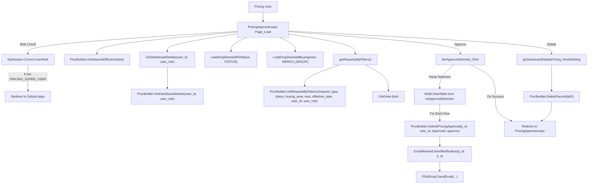
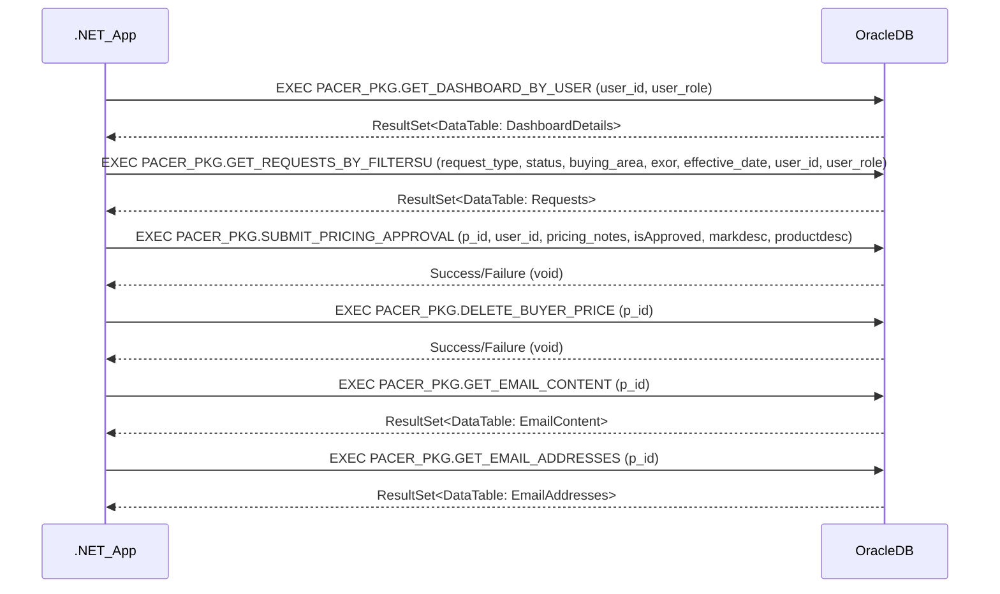
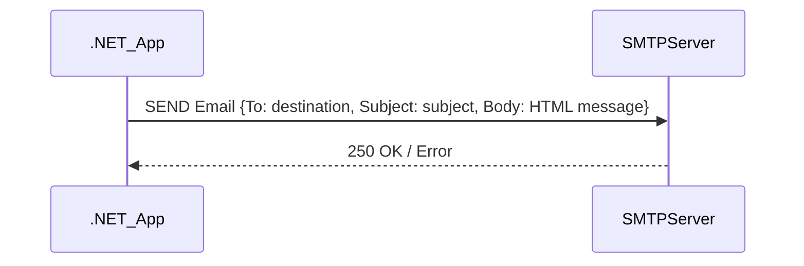
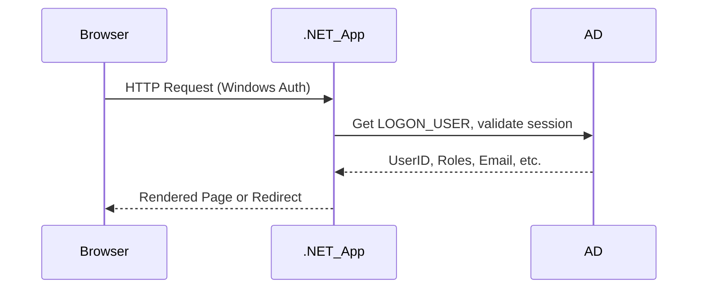
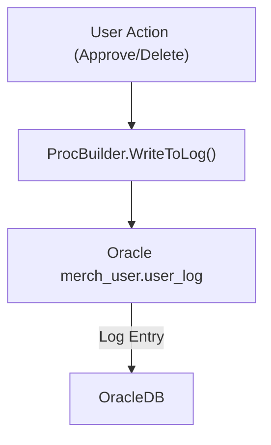

# Pricing Approval Workflow - Functional & Integration Documentation

## 1. Functional Flow Diagrams

### 1.1 Pricing Approval Request (Technical Execution Flow)

*Key technical notes:*
- Only users with `PRICING_SUPER_USER` role (from `MySession.Current.UserRole`) can access the page; others are redirected.
- Batch approval is handled by parsing a comma-separated string, building a DataTable, and iteratively calling `ProcBuilder.SubmitPricingApproval`.
- Each approval triggers an email notification via `EmailRevised.SendNotification`, which in turn uses `PRAEmail.SendEmail` (SMTP).
- Data access and workflow logic are encapsulated in `ProcBuilder` methods, which call Oracle stored procedures.
- GridView is refreshed after data changes.
- Exception handling is minimal in UI code-behind; most errors are caught and ignored or result in a redirect.

---

## 2. Core Business Functionalities

| Functionality Name         | Description                                                                 | Main Classes/Files                        | Key Business Rules / Validations                                                                                                  | Actors                    |
|---------------------------|-----------------------------------------------------------------------------|-------------------------------------------|-----------------------------------------------------------------------------------------------------------------------------------|---------------------------|
| Pricing Approval Dashboard| Displays pending pricing requests for approval, with filters and batch ops   | PricingApproval.aspx, PricingApproval.aspx.cs, ProcBuilder.cs | Only PRICING_SUPER_USER can access; filters by status, request type, buying area, effective date; shows requests needing approval | Pricing User (Super User) |
| Batch Pricing Approval    | Approve multiple pricing requests in a single action                        | PricingApproval.aspx.cs, ProcBuilder.cs    | Only selected requests are approved; each approval triggers workflow and notification; must parse selection for on/off state      | Pricing User              |
| Approval Submission       | Submits approval for a pricing request, updates status, logs action         | ProcBuilder.cs (SubmitPricingApproval)     | Calls Oracle proc; updates status to "Approved"; logs user and action; triggers notification                                      | Pricing User, System      |
| Email Notification        | Sends email to relevant parties on approval status change                   | EmailRevised.cs, PRAEmail.cs              | Email content and recipients depend on status transition and request type; uses SMTP with credentials from config                 | System, Pricing User      |
| Dashboard Filtering       | Filters dashboard by request type, status, buying area, effective date      | PricingApproval.aspx.cs, ProcBuilder.cs    | All filters are combined in `ProcBuilder.GetRequestByFiltersU`; only matching requests are shown                                  | Pricing User              |
| Role-Based Access Control | Restricts access to approval functions based on user role                   | MySession.cs, PricingApproval.aspx.cs      | Only users with PRICING_SUPER_USER role can access approval page and actions                                                      | Pricing User, System      |
| Delete Pricing Request    | Deletes a pricing request from dashboard                                    | PricingApproval.aspx.cs, ProcBuilder.cs    | Only allowed for eligible requests; calls Oracle proc to delete; refreshes dashboard                                              | Pricing User              |
| Audit Logging             | Logs user actions for audit and traceability                                | ProcBuilder.cs (WriteToLog), PCRDAL.cs     | Logs user, action, page, and context to Oracle via stored procedure                                                              | System                    |
| Exception Handling        | Handles errors in backend and notification flows                            | PricingApproval.aspx.cs, PRAEmail.cs       | UI code often redirects or ignores errors; email send failures return error string; backend errors may be logged                  | System, Pricing User      |

---

## 3. Integration Touchpoints & Interface Diagrams

### 3.1 Oracle Database (PACER_PKG, PACER_EXPORT, PACER_FILE_UPLOAD)

- All data access is via Oracle stored procedures, using `OracleCommand` and `PCRDAL` helper.
- Input: primitive types (string, int) for IDs, status, filters.
- Output: DataTable (for queries), void (for actions).

### 3.2 SMTP Email (Notification Integration)

- Email credentials (username/password) are decrypted from config.
- Email is sent from `noreply-pra@dcsg.com` to recipients determined by workflow and status.
- HTML email body contains request details, links, and status.

### 3.3 User Session/Authentication (Active Directory/Windows Auth)

- User session context is built from `LOGON_USER` server variable and Oracle user lookup.
- Only users with PRICING_SUPER_USER role can access approval workflow.

---

## 4. Exception Handling and Audit Flow Extraction

### 4.1 Exception Handling

- UI code (PricingApproval.aspx.cs) uses try/catch blocks in dropdown loading and ignores most exceptions (empty catch).
- Email sending (`PRAEmail.SendEmail`) catches exceptions and returns "An Error Occurred" string, but does not propagate or log.
- Backend (ProcBuilder.cs) relies on PCRDAL.ExecuteProc, which may log or throw errors (not shown in code).
- On error in approval selection, user is redirected to PricingApproval.aspx.

### 4.2 Audit Logging

- `ProcBuilder.WriteToLog()` logs user actions (report, version, browser info, URL) to Oracle via `merch_user.user_log` stored procedure.
- Audit log includes: user, page, action, comments, and machine info.

---

## 5. Appendix

### 5.1 List of Analyzed Files

- PricingApproval.aspx
- PricingApproval.aspx.cs
- PricingApproval.aspx.designer.cs
- App_Code/ProcBuilder.cs
- App_Code/EmailRevised.cs
- App_Code/PRAEmail.cs
- App_Code/MySession.cs
- Web.config (for SMTP and app settings)
- PCRDAL.cs (referenced, not shown)
- Oracle stored procedures (referenced, not shown)

### 5.2 Glossary of Business Terms

| Term                | Description                                                                 |
|---------------------|-----------------------------------------------------------------------------|
| PACER               | Pricing Approval Change Event Request system                                |
| PRICING_SUPER_USER  | User role with permission to approve pricing requests                       |
| DMM                 | Divisional Merchandise Manager (approver role)                              |
| Buyer               | User who submits pricing change requests                                    |
| Effective Date      | Date when approved pricing changes take effect                              |
| On Cadence          | Requests processed on a scheduled cadence                                   |
| Off Cadence         | Requests processed as exceptions                                            |
| GridView            | UI component displaying dashboard data                                      |
| DataTable           | .NET in-memory data structure for tabular data                              |
| Oracle Stored Proc  | Database procedure encapsulating business/data logic                        |
| SMTP                | Protocol for sending email notifications                                    |

---

**Note:**  
- All diagrams, flows, and descriptions are strictly related to the Pricing Approval Workflow.
- No unrelated modules or subsystems are included.
- All technical and business flows are traceable to specific classes, files, and integration points in the codebase.
