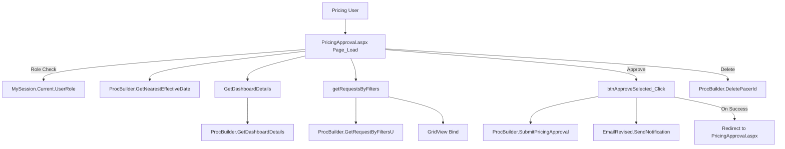
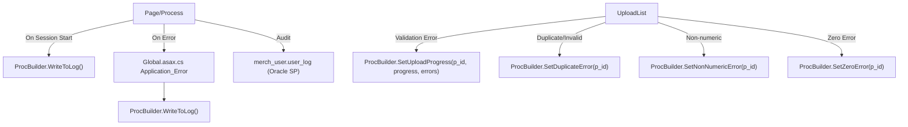
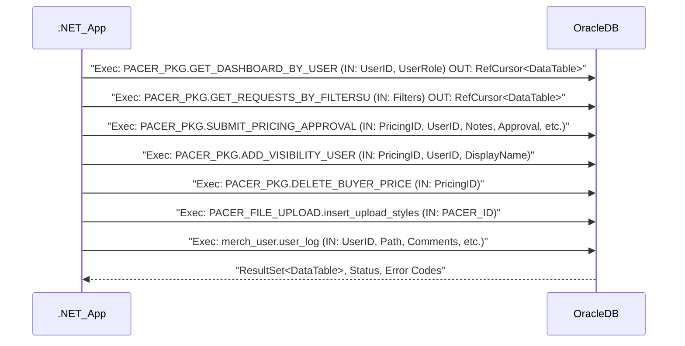
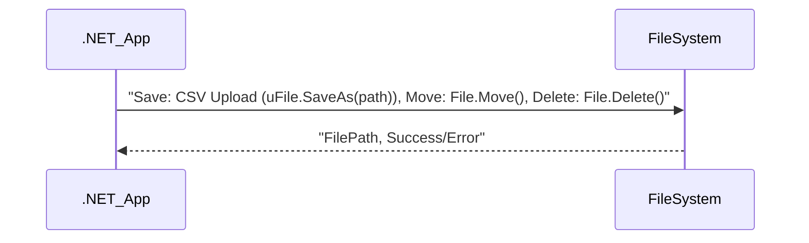
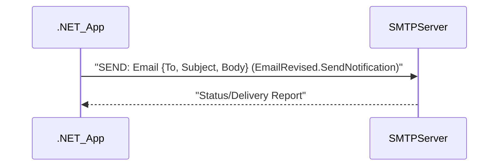

# .NET Application Functional & Integration Documentation

## 1. Functional Flow Diagrams

### 1.1 PACER Request Creation & Submission (Technical Execution Flow)

```mermaid
flowchart TD
    User["User (Buyer, DMM, etc.)"] --> RequestAspx["Request.aspx Page_Load"]
    RequestAspx -->|"On New"| PacerObj["Pacer (p_request=NEW)"]
    RequestAspx -->|"On Edit"| ProcBuilderGetPH["ProcBuilder.GetPHUploaded(p_id)"]
    ProcBuilderGetPH -->|"If Uploaded"| RedirectReview["Redirect to Review.aspx"]
    RequestAspx --> GetPacerDetails["GetPacerDetails(p_id)"]
    GetPacerDetails --> ProcBuilderGetData["ProcBuilder.GetDataByPacerId(p_id, PACER_HEADER)"]
    GetPacerDetails --> LoadControls["LoadControls(pacer)"]
    RequestAspx -->|"Build List"| BuildWorkingList["BuildWorkingList()"]
    BuildWorkingList -->|"STYLE"| BuildStyleLists["BuildStyleLists()"]
    BuildWorkingList -->|"SKU"| BuildSKULists["BuildSKULists()"]
    BuildWorkingList -->|"COLOR"| BuildColorLists["BuildColorLists()"]
    BuildStyleLists --> StyleValidate["Style.ValidateStyles()"]
    BuildSKULists --> SKUValidate["SKU.ValidateSKUs()"]
    BuildColorLists --> ColorValidate["StyleColors.ValidateColors()"]
    BuildWorkingList -->|"Data"| ProcBuilderGetStyleDetails["ProcBuilder.GetStyleDetails()"]
    BuildWorkingList -->|"Error"| ClientScript["ShowPopup/Error"]
    RequestAspx -->|"Upload"| UploadList["UploadList()"]
    UploadList -->|"CSV"| FileSave["File.SaveAs()"]
    UploadList -->|"Insert"| QueryBuilderInsert["QueryBuilder.InsertUploadLOC()"]
    UploadList -->|"STYLE"| StyleUpload["StyleUpload()"]
    UploadList -->|"SKU"| SKUUpload["SKUUpload()"]
    UploadList -->|"COLOR"| StyleColorUpload["StyleColorUpload()"]
    StyleUpload --> ProcBuilderValidateStyle["ProcBuilder.ValidateStyle()"]
    SKUUpload --> ProcBuilderValidateSKU["ProcBuilder.ValidateSKU()"]
    StyleColorUpload --> ProcBuilderValidateSKU["ProcBuilder.ValidateSKU()"]
    UploadList -->|"Error"| ClientScriptError["ShowPopup/Error"]
    RequestAspx -->|"Submit"| btnSubmit_Click["btnSubmit_Click()"]
    btnSubmit_Click --> AddPacerHeader["AddPacerHeader()"]
    AddPacerHeader --> QueryBuilderCheck["QueryBuilder.CheckForPacerID()"]
    AddPacerHeader --> AddPacer["AddPacer()"]
    btnSubmit_Click --> AddPacerDetails["AddPacerDetails()"]
    AddPacerDetails --> QueryBuilderSaveDetails["QueryBuilder.SaveDetailsBulkCopy()"]
    btnSubmit_Click -->|"On Success"| RedirectReview2["Redirect to Review.aspx"]
    btnSubmit_Click -->|"On Error"| ClientScriptSubmitError["ShowPopup/Error"]
    RequestAspx -->|"Exception"| Logger["ProcBuilder.WriteToLog()"]
```

*Key technical notes:*
- All data validation and upload logic is handled in code-behind, with heavy use of the `ProcBuilder` and `QueryBuilder` classes for database interaction.
- User role and authorization checks are performed via `MySession.Current.UserRole`.
- Errors and exceptions are surfaced to the user via client-side popups, and logged via `ProcBuilder.WriteToLog()`.

### 1.2 Pricing Approval Workflow (Technical Execution Flow)

*Key technical notes:*
- Only users with `PRICING_SUPER_USER` role can access.
- Batch approval and notification logic is present.
- All data access and workflow logic is encapsulated in `ProcBuilder` methods.

### 1.3 Exception Handling & Audit Logging Flow

*Key technical notes:*
- All major flows log user actions and errors to Oracle via stored procedures.
- Exceptions in upload/validation are tracked with progress/error codes and surfaced to the user.

---

## 2. Core Business Functionalities

| Functionality Name      | Description                                                                 | Main Classes/Files                  | Key Business Rules/Validations                                                                                              | Actors                |
|------------------------|-----------------------------------------------------------------------------|-------------------------------------|-----------------------------------------------------------------------------------------------------------------------------|-----------------------|
| PACER Request Creation  | Create new pricing requests for styles/SKUs/colors, including validation    | Request.aspx.cs, Pacer.cs, Style.cs, SKU.cs, StyleColors.cs, ProcBuilder.cs | Style/SKU/Color must be valid, price endings, duplicate checks, role-based access, required fields, max 500 items per batch | Buyer, DMM, SUPER_USER|
| Bulk Upload            | Upload lists of styles/SKUs/colors via CSV, validate and process in bulk    | Request.aspx.cs, ProcBuilder.cs, QueryBuilder.cs, Style.cs, SKU.cs, StyleColors.cs | Only CSV allowed, validate format/content, check for duplicates, non-numeric SKUs, zero prices not allowed                  | Buyer, DMM            |
| Pricing Approval       | Approve/reject requests via dashboard, batch approval, notification         | PricingApproval.aspx.cs, ProcBuilder.cs, EmailRevised.cs | Only PRICING_SUPER_USER can approve, status transitions, batch operations, email notification on approval                   | PRICING_SUPER_USER    |
| Dashboard & Reporting  | View/filter requests by status, date, merch group, export data              | PricingDashboard.aspx.cs, ProcBuilder.cs | Filter by multiple criteria, export to Excel, only authorized users can view relevant data                                  | All roles             |
| User Management        | Visibility and access control, add/remove users from request visibility     | Request.aspx.cs, MySession.cs, ProcBuilder.cs | Only authorized users can add/remove, role checks, session context                                                          | SUPER_USER, Buyer     |
| Exception Handling     | Track and log errors, validation failures, audit actions                    | ProcBuilder.cs, Global.asax.cs      | All errors logged, user actions audited, upload progress tracked with error codes                                           | All                   |
| Email Notification     | Send emails on approval, status changes, errors                             | EmailRevised.cs, PRAEmail.cs        | Triggered on approval, batch operations, errors                                                                             | System, Users         |
| Administrative Utilities| Download templates, export reports, manage stores/chains                   | Request.aspx.cs, ExportGridView.cs  | Only authorized users, data validation, export formatting                                                                   | Admin, SUPER_USER     |

---

## 3. Integration Touchpoints & Interface Diagrams

### 3.1 Oracle Database (Stored Procedures/Data Access)

*Data exchanged:*
- Input: User/session data, request/approval data, uploaded file data (CSV parsed to DataTable), error/audit info.
- Output: DataTable (dashboard, requests, validation results), status codes, error messages.

### 3.2 File System (Bulk Uploads)

*Data exchanged:*
- Input: CSV files containing style/SKU/price data.
- Output: File paths for further processing, error if invalid file.

### 3.3 Email Notification (SMTP)

*Data exchanged:*
- Input: Email notifications for approvals, errors, batch operations.
- Output: Delivery status.

---

## 4. Appendix

### List of analyzed files
- Global.asax.cs
- Request.aspx.cs
- PricingApproval.aspx.cs
- App_Code/ProcBuilder.cs
- App_Code/Style.cs, SKU.cs, StyleColors.cs, Pacer.cs
- App_Code/EmailRevised.cs, PRAEmail.cs
- App_Code/QueryBuilder.cs
- App_Code/MySession.cs
- Other code-behind files (Upload.aspx.cs, Maintenance.aspx.cs, etc.)
- Web.config (could not be parsed, but integration inferred from code)
- All .aspx and designer files (UI and event wiring)
- Content/CSS, Scripts/JS (UI, not core logic)
- App_Data (sample data files)

### Glossary of business terms
- PACER: Pricing Adjustment Change Event Request
- DMM: Divisional Merchandise Manager
- SKU: Stock Keeping Unit
- Style: Product style identifier
- Chain: Retail chain/store grouping
- Original/Exception: Types of pricing events/requests
- MPU: Multi-Price Upload (bulk operation)
- B&M: Brick & Mortar (physical stores)
- Ecomm: E-commerce channel
- RefCursor: Oracle data type for returning result sets
- BulkCopy: Efficient data insert operation for large batches
- Audit Log: Record of user/system actions for traceability

---

*Note: All diagrams and tables are in Markdown/Mermaid format and suitable for direct use in documentation or wikis. All business and technical flows are traceable to specific classes/files as required.*
